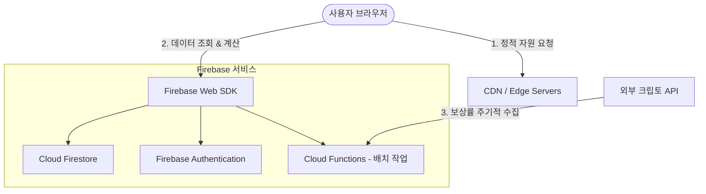

# 프로젝트 구조 및 기술 스택 분석 보고서

본 문서는 현재 로컬 개발 환경의 분석 결과와 크립토 스테이킹 보상률 비교 플랫폼(StakingMax)을 구축하기 위한 아키텍처 및 배포 전략을 다룹니다.

---

## 1. 현재 프로젝트 구조 분석

> [!NOTE]
> **현재 로컬 작업 공간 상태**
> 로컬 작업 공간 `/Users/james/Desktop/스테이킹맥스`는 현재 빈 디렉토리(Empty Directory) 상태에서 Vite + React + TypeScript 템플릿으로 초기화되었습니다.

### 향후 연동 방안
- 본 분석은 React/Vite 기반 프레임워크 템플릿 및 Firebase 연동 아키텍처를 기준으로 작성되었으며, 실제 구현 단계에서 최적의 컴포넌트 구조로 빌드할 예정입니다.

---

## 2. 사용 프레임워크 분석 및 권장안

Replit에서 빠른 프로토타이핑을 위해 구성할 수 있는 프레임워크 중, **월 200만 트래픽**과 **서버리스/정적 구조**에 가장 적합한 프레임워크를 분석합니다.

| 프레임워크 | 특징 | 장점 | 단점 | 월 200만 트래픽 관점 평가 |
| :--- | :--- | :--- | :--- | :--- |
| **React (Vite)** | 클라이언트 사이드 렌더링(CSR) 및 SPA(Single Page Application) 중심 | 빌드가 매우 빠르고 CDN(정적 배포) 비용이 거의 제로에 수렴 | SEO(검색엔진 최적화) 처리를 위해 별도의 Prerendering 또는 SSR/SSG 처리가 필요함 | **강력 추천 (정적 배포 최적)** Cloudflare Pages나 Vercel을 통한 완전 정적 파일 배포로 200만 트래픽 무상 소화 가능. 크립토 데이터의 SEO는 SSG 빌드 시점에 API 데이터를 정적 HTML로 생성하여 해결 가능. |
| **Next.js** | React 기반 Full-Stack 프레임워크 (SSR, SSG, ISR, Server Actions 제공) | SSG/ISR을 통한 강력한 SEO 지원, 서버리스 함수(API Routes) 내장 | Vercel 배포 시 Serverless Function 호출 횟수 제한(100만 회 초과 시 요금 발생) 및 Cold Start 이슈 | **추천 (하이브리드 배포)** ISR(Incremental Static Regeneration)을 활용하면 주기적으로 데이터를 갱신하면서 정적 페이지로 서빙하므로 대규모 트래픽에 유리. 단, 서버리스 함수 비용 모니터링 필요. |
| **기타 (Vanilla JS)** | 라이브러리 없는 순수 HTML/JS | 극도로 가볍고 용량이 작음 | 상태 관리, 라우팅, 컴포넌트 재사용 등 개발 생산성이 현저히 낮음 | 비추천 (비교 플랫폼 특성상 필터링, 검색, 계산기 등 인터랙티브 요소가 많아 생산성 저하) |

### 💡 최종 프레임워크 권장 전략: `Next.js (SSG/ISR)` 또는 `Vite + React (정적 SPA)`
- **정적 웹 브라우징 위주 + Firebase 직접 통신**: `Vite + React`로 빌드 후 완전 정적 HTML/JS를 Cloudflare Pages에 배포하는 것이 비용 및 트래픽 감당 측면에서 가장 유리합니다.
- **강력한 SEO(네이버/구글 검색 노출) 필수**: 한국 시장 타겟이므로 SEO가 핵심입니다. `Next.js`를 사용해 주기적으로 스테이킹 데이터를 정적으로 업데이트하는 **ISR(Incremental Static Regeneration)** 방식이 최선입니다.

---

## 3. Firebase 연결 구조 설계

Firebase는 클라이언트 측 SDK를 사용하여 서버리스 환경에서 데이터베이스(Firestore) 및 인증(Auth)에 직접 연결할 수 있습니다.

### 권장 연결 구조 (Vite / Next.js)
1. **환경 변수 관리**: Firebase 설정 키는 `.env.local`에 보관하여 GitHub에 노출되지 않도록 합니다.
2. **싱글톤 초기화**: App 전체에서 Firebase 인스턴스가 1번만 초기화되도록 `firebase/app` 설정을 모듈화합니다.
3. **직접 조회 최소화**: 클라이언트가 Firestore에 직접 실시간 리스너(`onSnapshot`)를 연결하면 200만 트래픽 발생 시 순식간에 **무료 제공량 및 Firestore 비용 한도(하루 5만 회 읽기)를 초과**합니다. 따라서 데이터 조회는 CDN 캐시를 거친 API나 Static Build 시점의 데이터를 활용해야 합니다.

---

## 4. 배포 방식 비교 및 최종 판단

월 200만 트래픽(일평균 약 6.7만 명, Peak 시 초당 수십~수백 명 접속)을 소화하기 위한 최적의 배포 파이프라인을 비교 분석합니다.

| 비교 항목 | Firebase Hosting | Vercel | Cloudflare Pages |
| :--- | :--- | :--- | :--- |
| **기본 아키텍처** | Google 글로벌 CDN 연동 정적 호스팅 | Edge Network + AWS Lambda 기반 서버리스 | Cloudflare 글로벌 Edge Network (100% Edge) |
| **대역폭(Bandwidth) 제한** | 무료 10GB/월 (이후 $0.15/GB) | Hobby 100GB/월 (이후 Pro 요금제 강제 $20/월 + 대역폭 요금) | **무제한 무료 (Unmetered Bandwidth)** |
| **서버리스 실행 제한** | Cloud Functions 요금 별도 부과 | Hobby 100만 회/월 (이후 제한) | Cloudflare Workers 무료 10만 회/일 |
| **SEO / SSR 연동** | Firebase Functions 연동 시 가능 (느림) | Next.js 최적화 (ISR/SSR 완벽 지원) | Remix, Next.js 등 다양한 프레임워크 Edge 빌드 지원 |

### 🏆 최종 배포지 선정: Cloudflare Pages (정적 자원) + Cloudflare Workers (Edge API)
- **이유**: 월 200만 트래픽 규모에서 이미지 및 정적 애셋 서빙 시 **대역폭(Bandwidth) 비용**이 가장 큰 복병입니다. Vercel이나 Firebase Hosting은 트래픽 초과 시 과금이 발생하지만, **Cloudflare Pages는 정적 대역폭을 무제한 무료**로 제공합니다.
- **Edge Caching 우수성**: Cloudflare의 강력한 캐싱 규칙(Page Rules)을 활용하여 Firebase 데이터를 가져오는 API 요청을 Cloudflare Edge 단에서 캐싱(예: 1시간 캐싱)하면 Firebase Firestore 읽기 비용을 거의 0원에 가깝게 유지할 수 있습니다.
